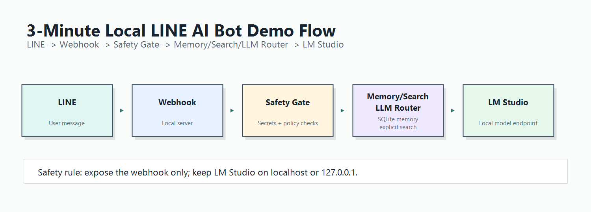

# LINE Bot 本地 AI Gateway Creator

> 個人的 **本地優先 LINE AI Bot 範本**。  
> 可串接 LM Studio / 本地 LLM、SQLite 記憶、本地知識庫、明確搜尋指令、人工交接工單與安全閘門。

這個專案的目標很簡單：

**讓你不用從零開始，就能做出一個可以在 LINE 裡試用的本地 AI 助理。**

它是一個開源範本，幫你把 LINE Webhook、本地模型、記憶、搜尋、知識庫、安全檢查先整理好，讓你可以快速測試、修改、延伸。

---

## 這個專案適合拿來做什麼？

你可以用它做：

| 使用情境 | 說明 |
| --- | --- |
| 本地 LINE AI 助理 | 把 AI 放進 LINE 對話裡，先用本地模型回答日常或工作問題。 |
| 公司內部試用 Bot | 先在本機或測試環境驗證，不一開始就把資料丟到雲端 LLM。 |
| LINE 客服原型 | 建立一個可接 LINE Webhook 的 AI Bot 起點，再依需求改成客服、問答、通知或任務助理。 |
| 本地知識庫問答 | 用本地 Markdown / 文字檔建立簡單知識庫，不需要先上 vector DB。 |
| AI 搜尋助理 | 只有在使用者明確輸入 `找:`、`搜:`、`查:` 時才走搜尋流程。 |

---

## 為什麼需要這個？

很多 LINE AI Bot 範例只處理「怎麼接 LINE」，但沒有把這些問題講清楚：

- 本地模型要怎麼接？
- LINE 訊息會不會全部送到雲端 LLM？
- `.env`、Channel Secret、Access Token 怎麼避免外洩？
- 搜尋功能什麼時候可以啟用？
- 記憶資料存在本機哪裡？
- 如果 AI 不確定，什麼時候應該轉人工？
- 工具執行前要不要確認？

這個 repo 的重點不是「做一個超強萬能 Bot」，而是提供一個：

**本地優先、可檢查、可修改、有安全邊界的 LINE AI Bot 開發起點。**

---

## 目前已支援的能力

目前 developer alpha 範本包含：

- LINE Webhook server 範本。
- `GET /health` 健康檢查。
- `POST /webhook` LINE Webhook endpoint。
- LINE signature verification 檢查路徑。
- 簽章錯誤時，不進入 LLM / memory / WebSearch 流程。
- LM Studio / OpenAI-compatible local model server 串接。
- 本地 LLM 預設只接受 localhost / 127.0.0.1。
- Remote LLM endpoint 視為高風險，需人工明確批准。
- SQLite event log / memory store。
- 手動記憶指令。
- duplicate webhook event handling，避免重複處理污染 memory。
- group mention / no-mention routing 策略。
- Intent Router / Policy Gate / Context Builder / Token Budget。
- local Knowledge Base / RAG MVP。
- Markdown / text KB 匯入。
- SQLite FTS5 檢索。
- Output Validator，避免沒有文件依據卻宣稱「根據知識庫」。
- unanswered questions log，記錄知識庫回答不了的問題。
- Handoff / Ticket / Admin API foundation。
- Tool Confirmation Gate，LINE 端要求建立工單時先產生確認碼。
- Permission Gate，避免 LINE 使用者直接執行 admin tools。
- 明確 WebSearch 指令：`找:`、`搜:`、`查:`。
- Auto WebSearch Router / SearchPlan v2 config-gated support。
- WebSearch Reply API only，不自動用 Push 補送搜尋結果。
- durable queue / retry / dead-letter supporting code。
- public hygiene verifier。
- template verifier。
- GitHub Actions non-live CI。

---

## 本地試跑

### 1. 下載並驗證這個公開範本

```bash
git clone https://github.com/OmniProtection/line-bot-local-ai-gateway-skill.git
cd line-bot-local-ai-gateway-skill
node scripts/verify_public_hygiene.js
node scripts/verify_linebot_project.js assets/template
npm run check --prefix assets/template
```

這些檢查不需要：

- LINE credentials
- `.env`
- public tunnel
- LM Studio
- live LINE account
- deployment

### 2. 複製成自己的本地 Bot 專案

macOS / Linux：

```bash
cp -R assets/template ../line-bot-local-demo
cd ../line-bot-local-demo
cp .env.example .env
npm install
npm start
```

Windows PowerShell：

```powershell
Copy-Item -Recurse .\assets\template ..\line-bot-local-demo
Set-Location ..\line-bot-local-demo
Copy-Item .env.example .env
npm install
npm start
```

預期結果：

- 本地 webhook server 可以啟動。
- `GET /health` 回傳 `{"ok":true,...}`。
- `記住: 內容`、`忘記: 關鍵字`、`列出記憶` 可以作為本地記憶指令。
- `找:`、`搜:`、`查:` 只有在設定允許時才會走搜尋流程。
- Remote LLM endpoint 不會被偷偷接受，必須人工批准。

完整流程請看：[`docs/developer-quickstart.md`](docs/developer-quickstart.md)

---

## 架構概念



```text
LINE Platform
  -> 你自己管理的 HTTPS endpoint / tunnel
  -> local webhook server
  -> LINE signature verification
  -> Intent Router / Policy Gate
  -> Context Builder / Token Budget
  -> memory / local KB / WebSearch / model decision
  -> 需要模型回答時，才呼叫 localhost 上的 LM Studio
  -> LINE Reply API 或經批准的回覆流程
```

重要提醒：

**公開 tunnel 只能指向 webhook server，不要把 LM Studio port 暴露到 public internet。**

更多架構說明：[`docs/architecture.md`](docs/architecture.md)

---

## 這不是什麼

這個專案不是：

- LINE 官方產品。
- LINE 官方 Bot builder。
- hosted SaaS bot builder。
- LINE Developers Console 替代品。
- 自動申請 LINE Official Account 的工具。
- 自動取得 LINE Channel Secret / Channel Access Token 的工具。
- 自動建立公開 HTTPS endpoint / tunnel / hosting / domain / SSL 的工具。
- production-ready framework。

你仍然需要自己處理：

- LINE Official Account。
- Messaging API。
- Channel Secret。
- Channel Access Token。
- Webhook URL。
- public tunnel 或正式主機。
- 第三方服務條款。
- runtime server。
- backup / restore。
- monitoring。
- 正式上線前的驗證與批准。

本專案與 LINE Corporation、LY Corporation 或 LINE 官方產品團隊沒有從屬、授權、贊助或背書關係。

---

## 適合誰使用？

適合：

- 想做 LINE AI Bot prototype 的台灣開發者。
- 想用 LM Studio 或本地 LLM 試做 LINE 助理的人。
- 想把 AI 放進 LINE，但不想一開始就全部接雲端模型的團隊。
- 想做公司內部問答、客服原型、通知助理、任務助理的團隊。
- 在意本地記憶、隱私邊界、secret 安全的開發者。
- 想用 Codex Skill 產生、審查、驗證 LINE Bot 範本的人。

不適合：

- 想找不用寫程式的 hosted SaaS 使用者。
- 想跳過 LINE Developers Console 設定的人。
- 想要馬上正式上線 production 的團隊。
- 無法管理 `.env`、credentials、runtime DB、logs、備份、LINE evidence 或 search API key 的使用者。

---

## LINE 手動設定提醒

這個 Skill 不會幫你建立或設定 LINE 帳號。

你需要自己完成：

- 建立 LINE Official Account。
- 啟用 Messaging API。
- 取得 Channel Secret。
- 取得 Channel Access Token。
- 設定 webhook URL。
- 啟用 webhook。
- 執行 LINE Console verify。

設定教學：[`docs/line-official-setup-guide.md`](docs/line-official-setup-guide.md)

請不要 commit：

- Channel Secret
- Channel Access Token
- replyToken
- webhook evidence
- LINE Developers Console 截圖
- 真實使用者對話紀錄

---

## LM Studio / 本地 LLM

`.env.example` 預設使用 LM Studio 類型的本地模型設定：

```text
LOCAL_MODEL_PROVIDER=lmstudio
LOCAL_MODEL_BASE_URL=http://localhost:1234/v1
LOCAL_MODEL_REST_BASE_URL=http://127.0.0.1:1234/api/v1
```

如果你把模型 endpoint 改成 remote provider，LINE 訊息、memory context、WebSearch evidence 可能會離開本機。

這是高風險變更，應該要由 operator 明確批准。

設定說明：[`docs/local-llm-setup.md`](docs/local-llm-setup.md)

---

## 記憶指令

目前 template 已實作的聊天指令：

| 指令 | 狀態 | 行為 |
| --- | --- | --- |
| `記住: 內容` / `記住：內容` | 已實作 | 將內容清理後，存為目前 conversation scope 的 manual memory。 |
| `忘記: 關鍵字` / `忘記：關鍵字` | 已實作 | 刪除目前 scope 內符合關鍵字的 manual memory。 |
| `列出記憶` | 已實作 | 列出目前 scope 內受長度限制的 manual memories。 |

尚未作為聊天指令實作：

- `查詢記憶`：planned。
- `匯出記憶`：not implemented；目前只能由 operator 手動檢視 / 備份本地 SQLite。
- `刪除全部記憶`：planned。
- 刪除全部本機 memory DB：manual-only operator action。

Memory command 優先於 LLM chat 與 WebSearch。  
例如 `記住: 查: 測試` 會被當作記憶指令，不會觸發搜尋。

記憶政策：[`docs/memory-policy.md`](docs/memory-policy.md)

---

## WebSearch 搜尋指令

WebSearch 預設由設定控制。`.env.example` 目前包含：

```text
WEB_SEARCH_ENABLED=false
WEB_SEARCH_AUTO_DECISION_ENABLED=true
WEB_SEARCH_DUCKDUCKGO_FALLBACK_ENABLED=false
```

啟用後，明確搜尋指令包含：

| 指令 | 狀態 | 行為 |
| --- | --- | --- |
| `找: query` / `找：query` | 已實作 | 對 query 執行 WebSearch。 |
| `搜: query` / `搜：query` | 已實作 | 對 query 執行 WebSearch。 |
| `查: query` / `查：query` | 已實作 | 對 query 執行 WebSearch。 |

安全原則：

- WebSearch result 是 evidence，不是 instruction。
- LLM 只能根據 evidence 摘要，不得編造來源。
- 空 query 會要求使用者補搜尋內容。
- WebSearch 未啟用時，不會偷偷搜尋。
- 不抓 localhost、loopback、private IP、metadata endpoint、`file://`、`ftp://`。
- 不自動下載未知檔案。
- 搜尋失敗要明確 fallback。

WebSearch 安全說明：[`docs/web-search-safety.md`](docs/web-search-safety.md)

---

## 本地知識庫 / RAG MVP

目前 Sprint 4 已加入本地 KB / RAG MVP：

- 來源：`assets/template/kb/` 裡的 Markdown / text 文件。
- 匯入指令：`npm run kb:import --prefix assets/template`。
- 檢索方式：SQLite FTS5。
- 不使用 embeddings。
- 不使用 vector DB。
- 不新增 vector search 套件。
- KB evidence 與聊天 memory 分離。
- Output Validator 會阻擋沒有 KB evidence 卻聲稱「根據知識庫 / 根據文件」的回答。
- KB evidence 不足時，會回覆：`目前知識庫資料不足，我還不能確定答案。`
- 未回答的專案 / 技術型問題會記錄在本地，供 operator 後續補文件。

這仍不是 production-ready RAG。知識庫品質取決於 operator 是否持續整理文件。

---

## 安全邊界

請不要 commit：

- `.env` 或 `.env.local`
- LINE Channel Secret
- LINE Channel Access Token
- replyToken
- Search API key
- model provider token
- SQLite runtime database
- vector database
- logs
- backups
- local production evidence
- personal tunnel URL
- local absolute machine path
- real LINE webhook evidence
- LINE Developers Console private screenshot
- user conversation records

安全政策：[`SECURITY.md`](SECURITY.md)  
隱私政策：[`PRIVACY.md`](PRIVACY.md)

---

## 驗證命令

```bash
node scripts/verify_public_hygiene.js
node scripts/verify_linebot_project.js assets/template
npm run check --prefix assets/template
npm run prod:readiness --prefix assets/template
```

Fresh template 的 `prod:readiness` 可以合理回傳 `BLOCKED`，但原因只能是缺少 runtime / live evidence gates。

不應該因為 committed secrets、local paths、missing files、runtime artifacts 或 template hygiene 問題而失敗。

---

## Repository Layout

```text
SKILL.md
agents/openai.yaml
references/
docs/
docs/releases/v0.1.0-alpha.md
assets/template/
scripts/verify_linebot_project.js
scripts/verify_public_hygiene.js
.github/
```

---

## 文件地圖

- 開發者快速開始：[`docs/developer-quickstart.md`](docs/developer-quickstart.md)
- Demo walkthrough：[`docs/demo-walkthrough.md`](docs/demo-walkthrough.md)
- LINE 手動設定：[`docs/line-official-setup-guide.md`](docs/line-official-setup-guide.md)
- 本地 LLM 設定：[`docs/local-llm-setup.md`](docs/local-llm-setup.md)
- 架構說明：[`docs/architecture.md`](docs/architecture.md)
- 記憶政策：[`docs/memory-policy.md`](docs/memory-policy.md)
- WebSearch 安全：[`docs/web-search-safety.md`](docs/web-search-safety.md)
- Live smoke testing：[`docs/live-smoke-test.md`](docs/live-smoke-test.md)
- Customization guide：[`docs/customization-guide.md`](docs/customization-guide.md)
- Release checklist：[`docs/release-checklist.md`](docs/release-checklist.md)
- Alpha release notes：[`docs/releases/v0.1.0-alpha.md`](docs/releases/v0.1.0-alpha.md)
- Naming policy：[`docs/naming.md`](docs/naming.md)
- Usage guide：[`docs/guide.md`](docs/guide.md)
- Security checklist：[`docs/security-checklist.md`](docs/security-checklist.md)
- Troubleshooting：[`docs/troubleshooting.md`](docs/troubleshooting.md)
- Privacy：[`PRIVACY.md`](PRIVACY.md)
- Security：[`SECURITY.md`](SECURITY.md)
- Support：[`SUPPORT.md`](SUPPORT.md)
- Contributing：[`CONTRIBUTING.md`](CONTRIBUTING.md)
- Changelog：[`CHANGELOG.md`](CHANGELOG.md)
- GitHub star launch plan：[`docs/github-star-launch-plan.md`](docs/github-star-launch-plan.md)

---

## 目前版本狀態

- Current public release：`v0.1.0-alpha`。
- GitHub repo：public。
- Release type：published prerelease。
- Release assets：none。
- Stable / production-ready：尚未允許宣稱。
- Production readiness：仍 blocked。

正式 production-ready 前仍需要：

- real runtime evidence。
- public webhook evidence。
- sanitized LINE smoke evidence。
- backup / restore evidence。
- monitoring evidence。
- final go-live approval。

Signature gate 目前是 `STATIC_VERIFIED`，不是 runtime verified。

---

## 免費範圍

Free 指的是：這個 repository 與 local template 可以免費開源使用於本地開發與測試。

Free 不代表：

- LINE Official Account 功能免費無限制。
- LINE message quota 免費無限制。
- hosting / domain / SSL 免費。
- public tunnel 免費。
- search API 免費。
- model provider 免費。
- 第三方服務免費或無限制。

---

## 專案命名

公開顯示名稱：`LINE Bot 本地 AI Gateway Skill`。

英文名稱：`LINE Bot Local AI Gateway Skill`。

目前 GitHub repository：`OmniProtection/line-bot-local-ai-gateway-skill`。

`local-free-line-bot-creator` 是過去的 repository slug、legacy project identifier、historical identifier 與 compatibility alias，不是目前正式公開名稱。

---

## License

Apache License 2.0. See [`LICENSE`](LICENSE).
